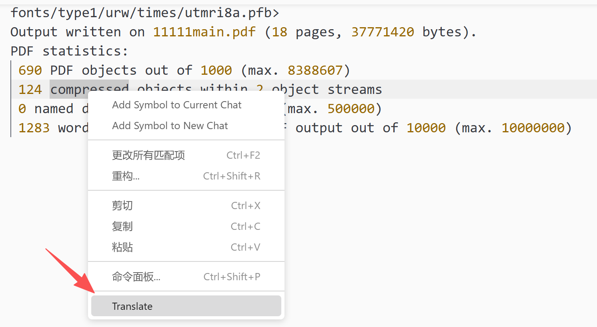
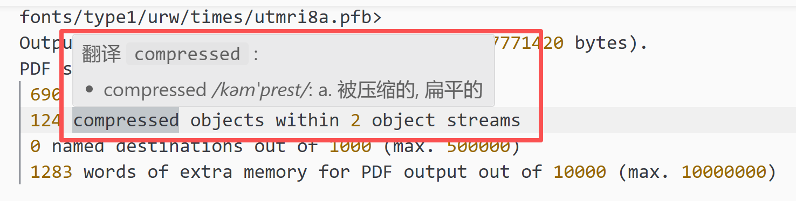

# Code Translate for VS Code

## 简介

Code Translate 是一款纯粹的滑词翻译软件, 在下面项目基础上进行修正.(感谢: https://github.com/w88975/code-translate-vscode)

1. 无侵入式的显示翻译结果: 与VS Code代码分析完美结合 

2. 强大的单词拆分能力: 支持驼峰, 下划线形式等各种单词拆分

3. 丰富的本地词库: 包含 340 万+离线单词, 支持各种生僻单词

4. 基于丰富的本地词库: Code Translate 拥有超快的查询速度, 每个单词在基本在 10ms 内可查询完毕

5. 多端支持: VS Code 桌面版 和 VS Code Online 版本, 插件均可支持

6. 将原本的鼠标悬停翻译修改为了光标所在位置右键菜单栏里翻译.

---

## 预览

 - 右键菜单翻译(新增功能):
   
   然后展示
   
- 自动拆分组合词(原始功能):
  
- 自由框选单词(原始功能):
  
- 跳转第三方查询(原始功能):
  

---
## License

MIT License

Copyright (c) [2025] [zhangquan]

Permission is hereby granted, free of charge, to any person obtaining a copy
of this software and associated documentation files (the "Software"), to deal
in the Software without restriction, including without limitation the rights
to use, copy, modify, merge, publish, distribute, sublicense, and/or sell
copies of the Software, and to permit persons to whom the Software is
furnished to do so, subject to the following conditions:

The above copyright notice and this permission notice shall be included in all
copies or substantial portions of the Software.

THE SOFTWARE IS PROVIDED "AS IS", WITHOUT WARRANTY OF ANY KIND, EXPRESS OR
IMPLIED, INCLUDING BUT NOT LIMITED TO THE WARRANTIES OF MERCHANTABILITY,
FITNESS FOR A PARTICULAR PURPOSE AND NONINFRINGEMENT. IN NO EVENT SHALL THE
AUTHORS OR COPYRIGHT HOLDERS BE LIABLE FOR ANY CLAIM, DAMAGES OR OTHER
LIABILITY, WHETHER IN AN ACTION OF CONTRACT, TORT OR OTHERWISE, ARISING FROM,
OUT OF OR IN CONNECTION WITH THE SOFTWARE OR THE USE OR OTHER DEALINGS IN THE
SOFTWARE.

----

This project is tested with BrowserStack
